# Agentic RAG Chatbot with Streamlit and LangGraph

This project is an advanced Retrieval-Augmented Generation (RAG) chatbot featuring an agentic workflow powered by LangGraph. Users can upload a PDF and ask questions about its content via a Streamlit interface. If the answer isn’t found in the document, the agent can search the web automatically.

---

## ✨ Features

- **PDF Processing:** Upload and extract text from any PDF.  
- **Agentic Workflow:** Stateful, multi-step agent using LangGraph for reasoning and decision-making.  
- **Confidence-Based Routing:** Answers from the PDF if confident, otherwise falls back to web search.  
- **Web Search Fallback:** Uses Tavily AI for external queries.  
- **Document Summarization:** `summarize` command generates a concise summary.  
- **Interactive UI:** Simple web interface built with Streamlit.  

---

## 🔑 API Keys Required

- Google Gemini API key  
- Tavily AI API key  

---

## ⚙️ How It Works

The application uses a stateful graph (LangGraph) to define agent workflow paths. Each step is a node, and transitions are directed by edges.

### Visual Workflow

```mermaid
graph TD
    A(Start: User uploads PDF & asks question) --> B[initialize_models];
    B --> C[load_pdf_text];
    C --> D[chunk_text];
    D --> E[create_chroma_index];
    E --> F[retrieve];

    F --> G{route_after_retrieval};
    G -- "Query is 'summarize'" --> H[summarize];
    G -- "Normal question" --> I[evaluate];

    I --> J{route_after_evaluation};
    J -- "Confidence ≥ 0.6" --> K[generate];
    J -- "Confidence < 0.6" --> L[web_search];

    L --> K;

    K --> M(End: Display Answer);
    H --> M;

    classDef start-end fill:#28a745,stroke:#333,stroke-width:2px,color:#fff;
    classDef process fill:#007bff,stroke:#333,stroke-width:2px,color:#fff;
    classDef decision fill:#ffc107,stroke:#333,stroke-width:2px,color:#000;
    classDef special-path fill:#fd7e14,stroke:#333,stroke-width:2px,color:#fff;

    class A,M start-end;
    class B,C,D,E,F,I,K,L,H process;
    class G,J decision;

```



## 🚀 Getting Started

### 1. Prerequisites
- Python 3.10+ (Recommended Python 3.14.2)
- [Poetry](https://python-poetry.org/) or [venv](https://docs.python.org/3/library/venv.html)

### 2. Installation
Clone the repository and install the dependencies:
```bash
# Create and activate virtual environment
python -m venv .venv
.\.venv\Scripts\Activate.ps1  # Windows
source .venv/bin/activate     # Unix/macOS

# Install dependencies
pip install -r requirements.txt
```

### 3. Configuration
Create a `.env` file in the root directory (using `.env.example` as a template):
```bash
GEMINI_API_KEY=your_gemini_api_key
TAVILY_API_KEY=your_tavily_api_key
```

### 4. Usage
Run the Streamlit application:
```bash
streamlit run AgenticRAG_using_LangGraph.py
```

## 📁 Project Structure
- `AgenticRAG_using_LangGraph.py`: Main application logic and Streamlit UI.
- `data/`: Sample PDF documents for testing.
- `.env.example`: Template for environment variables.
- `requirements.txt`: Project dependencies.
